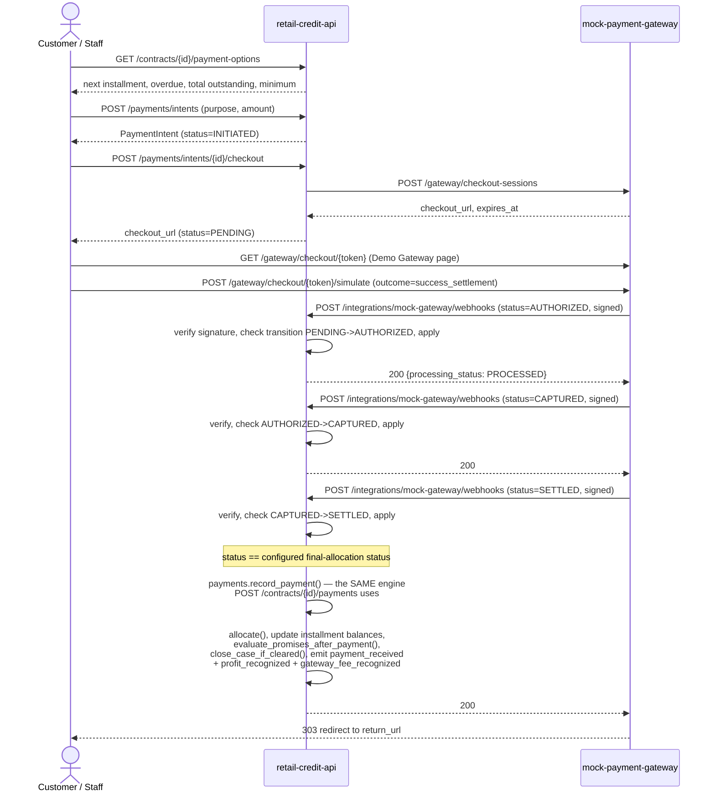
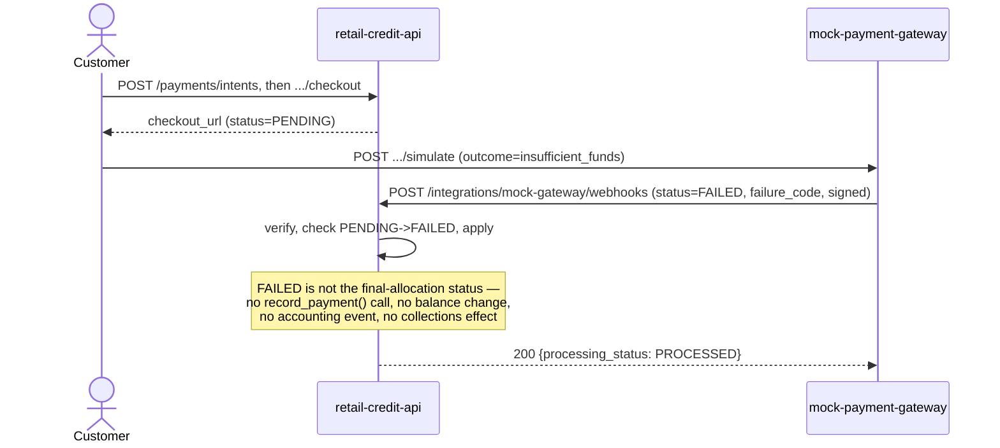
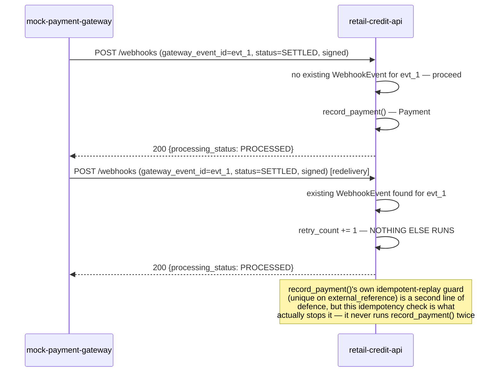
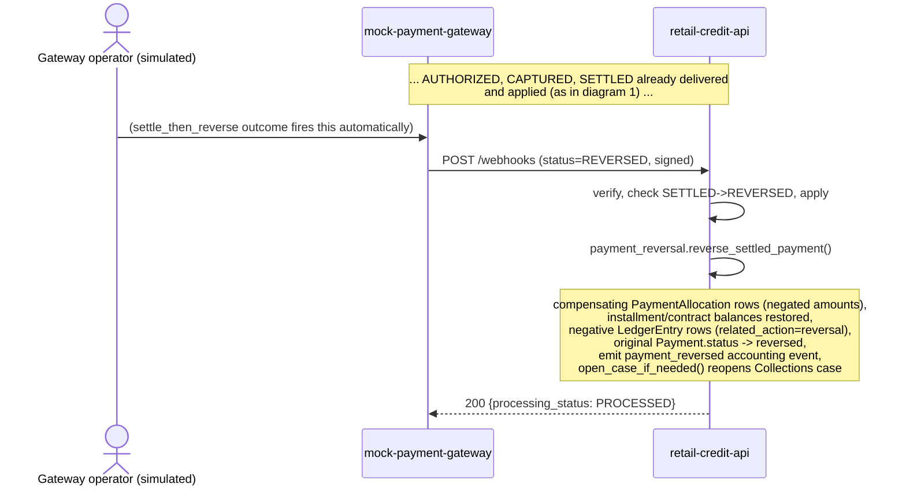

# Payment Flow — Mock Payment Gateway

Companion to [FSD.md](FSD.md) §2. Four sequence diagrams covering the
scenarios the brief calls out by name, plus the full table of which
simulated checkout outcome fires which webhook sequence.

All diagrams show three real, separately-deployed participants: the
browser (customer or staff), **retail-credit-api**, and the separate
**mock-payment-gateway** service. Nothing here is simplified for the
diagram — this is the literal call sequence in the code.

---

## 1. Successful payment and settlement

## 2. Failed payment

A decline never has to pass through AUTHORIZED — the gateway can report a
straight `PENDING -> FAILED`, exactly like a real authorization decline.

## 3. Duplicate webhook

The gateway's own `duplicate_webhook` demo outcome deliberately resends the
final SETTLED event a second time with the SAME `gateway_event_id`.

## 4. Reversal (settle, then reverse)

---

## 5. Every simulated outcome, and the webhook sequence it fires

(`mock-payment-gateway/app/main.py::simulate_outcome`, one clause per
outcome — this table is exhaustive.)

| Outcome (checkout page button) | Webhook sequence fired | Demonstrates |
|---|---|---|
| `success_settlement` | AUTHORIZED → CAPTURED → SETTLED | The full happy path |
| `success_authorization_only` | AUTHORIZED | A hold with no capture yet |
| `insufficient_funds` | FAILED (`failure_code=insufficient_funds`) | A straight decline |
| `customer_cancel` | CANCELLED | Customer abandons the page |
| `timeout` | EXPIRED | Session times out |
| `delayed_settlement` | AUTHORIZED → CAPTURED immediately, SETTLED after `DELAYED_SETTLEMENT_SECONDS` (a background timer) | A next-day-batch-style delayed settlement, compressed |
| `duplicate_webhook` | AUTHORIZED → CAPTURED → SETTLED → SETTLED again (same `gateway_event_id`) | Idempotent duplicate handling (diagram 3) |
| `invalid_signature` | AUTHORIZED, deliberately signed with the wrong payload | `REJECTED_SIGNATURE` |
| `settle_then_reverse` | AUTHORIZED → CAPTURED → SETTLED → REVERSED | Reversal (diagram 4) |

An **out-of-order / replayed** webhook (e.g. a stray AUTHORIZED arriving
after SETTLED) is not one of the buttons above — it is produced in tests by
crafting the HTTP call directly
(`tests/test_payment_gateway.py::test_out_of_order_webhook_is_rejected_without_moving_status_backwards`),
since a real gateway could in principle redeliver an older event out of
order even though this mock gateway's own sender never does so by itself.
