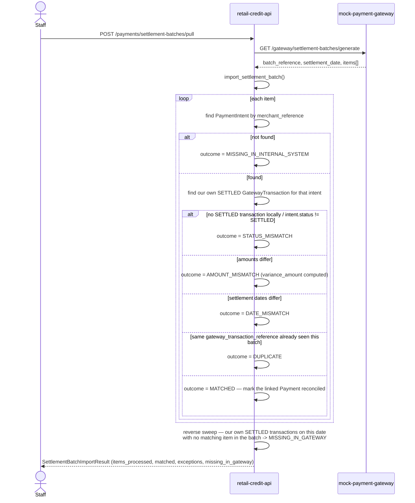

# Reconciliation — Mock Payment Gateway

## 1. Relationship to the existing Bank Reconciliation module

**This was an explicit question the user asked before any code was
written**, and the answer below is what was actually implemented — not a
retrofit justification.

The platform already has a bank-reconciliation module (P0-5,
`app/models/reconciliation.py`, `app/services/reconciliation.py`,
`/reconciliation/*`): it matches recorded `Payment` rows against
`BankStatementLine` rows (one line per bank transfer, manually ingested or
uploaded as an .xlsx), with a three-reason exception taxonomy
(`no_match`, `amount_mismatch`, `duplicate_candidate`).

The gateway-settlement reconciliation this feature adds
(`app/models/gateway_settlement.py`,
`app/services/gateway_reconciliation.py`, `/payments/settlement-batches`,
`/payments/reconciliation-items`) is a **genuinely separate process**, for
three concrete reasons:

1. **Different external actor.** A bank statement line comes from the
   company's bank; a settlement batch comes from the payment gateway. These
   are two different real-world documents a Kuwait retail business would
   receive from two different counterparties, on two different schedules.
2. **Different granularity.** A settlement batch is a whole day's worth of
   transactions with its own gross/fee/net totals (`SettlementBatch`); a
   bank line is one transfer. A gateway transaction also carries a
   `gateway_fee` the bank feed has no equivalent field for.
3. **A richer, gateway-specific exception taxonomy.** `MATCHED`,
   `MISSING_IN_GATEWAY`, `MISSING_IN_INTERNAL_SYSTEM`, `AMOUNT_MISMATCH`,
   `STATUS_MISMATCH`, `DUPLICATE`, `DATE_MISMATCH`, `UNRESOLVED` — the bank
   module's three reasons don't express "the gateway says this settled,
   our own webhook processing never got that far" (`STATUS_MISMATCH`), or
   "we have a settled transaction the gateway's feed never mentioned at
   all" (`MISSING_IN_GATEWAY`), both of which are specific to comparing
   against an upstream *processor's* feed rather than a downstream bank
   statement.

**What IS reused, deliberately, rather than duplicated:**

- The generic maker-checker engine
  (`app/services/approvals.py`, `ApprovalRequest`) — a new action type
  (`ACTION_GATEWAY_RECON_RESOLVE`), not a second approval system.
- `app/services/audit.py::record_event` — the same audit trail every other
  module writes to.
- `Payment.reconciliation_status` (the SAME column the bank module
  writes) — a `MATCHED` gateway-reconciliation item also marks the
  linked `Payment` `reconciled`, so `GET /reconciliation/status`'s
  existing counts stay meaningful regardless of which reconciliation
  process actually reconciled a given payment, without a second status
  field.

## 2. Daily settlement batch — structure

One `SettlementBatch` row (`batch_reference` unique, `settlement_date`,
currency, item counts and gross/fee/net totals) plus one
`ReconciliationItem` row per line. A batch is produced by the separate
mock-payment-gateway service's own `GET /gateway/settlement-batches/generate`
— every `GatewayTransactionRecord` on the gateway's side with
`status == SETTLED` and a `settlement_timestamp` matching the requested
date (default: today), shaped exactly as the import endpoint expects:

```json
{
  "batch_reference": "GW-SETTLEMENT-2026-09-14",
  "settlement_date": "2026-09-14",
  "currency": "KWD",
  "items": [{
    "gateway_transaction_reference": "GWTXN-...",
    "merchant_reference": "PI-000042",
    "settlement_date": "2026-09-14",
    "gross_amount": "87.46",
    "gateway_fee": "1.31",
    "net_amount": "86.15",
    "currency": "KWD",
    "gateway_status": "SETTLED"
  }]
}
```

## 3. Import & matching sequence



`UNRESOLVED` is the literal fallback for an item that fits none of the
above (in practice, a blank `merchant_reference`) — kept as its own
outcome because the brief specifies it as a distinct bucket, not folded
into `MISSING_IN_INTERNAL_SYSTEM`.

## 4. Manual resolution (maker-checker)

```mermaid
sequenceDiagram
    actor Maker as Staff (maker)
    actor Checker as A DIFFERENT staff member (checker)
    participant App as retail-credit-api

    Maker->>App: POST /payments/reconciliation-items/{id}/resolve<br/>{reason, comments}
    App->>App: create ApprovalRequest (ACTION_GATEWAY_RECON_RESOLVE)
    App-->>Maker: 201 pending ApprovalRequest

    Checker->>App: POST /approvals/{id}/approve
    App->>App: decided_by != requested_by — enforced, else 409
    App->>App: gateway_reconciliation.apply_resolution()
    App->>App: item.status = resolved; if variance_amount != 0<br/>and the contract is known -> emit SETTLEMENT_DIFFERENCE
    App-->>Checker: 200 {status: approved}
```

Every manual resolution requires a `reason`, optional `comments`, is
attributed to an authorized, authenticated user
(`requested_by`/`decided_by`, both real user IDs, timestamped), and a
confirmed monetary variance against a known contract books a
`SETTLEMENT_DIFFERENCE` accounting event — never silently absorbed.

## 5. Outcome reference

| Outcome | Meaning | Auto-resolved? |
|---|---|---|
| `MATCHED` | Gateway and internal records agree on amount, fee, date, status | Yes — item created already `resolved` |
| `MISSING_IN_GATEWAY` | This app has a SETTLED transaction the gateway's feed never mentioned | No — exception queue |
| `MISSING_IN_INTERNAL_SYSTEM` | The gateway's feed mentions a transaction this app has no record of | No |
| `AMOUNT_MISMATCH` | Reference matches; gross amount differs | No — `variance_amount` populated |
| `STATUS_MISMATCH` | The gateway reports SETTLED; this app's own status disagrees (not yet processed, or since reversed) | No |
| `DUPLICATE` | Same `gateway_transaction_reference` appears twice in one batch | No |
| `DATE_MISMATCH` | Amounts agree; settlement date differs | No |
| `UNRESOLVED` | Fits none of the above (e.g. malformed item) | No |

## 6. What the reconciliation engine deliberately does NOT do

- It never changes a `PaymentIntent`'s status, never re-triggers allocation,
  and never touches a contract's balance — it only *compares* and,
  on manual resolution, books an accounting-event-level adjustment.
- It does not attempt to auto-resolve `MISSING_IN_GATEWAY` /
  `MISSING_IN_INTERNAL_SYSTEM` / `STATUS_MISMATCH` — these always require a
  human decision (a genuine data gap, not a computable correction).
- It does not run on a schedule (see BRD.md §6) — `POST
  /payments/settlement-batches/pull` and the manual JSON `POST
  /payments/settlement-batches` import are both explicitly staff-triggered.
